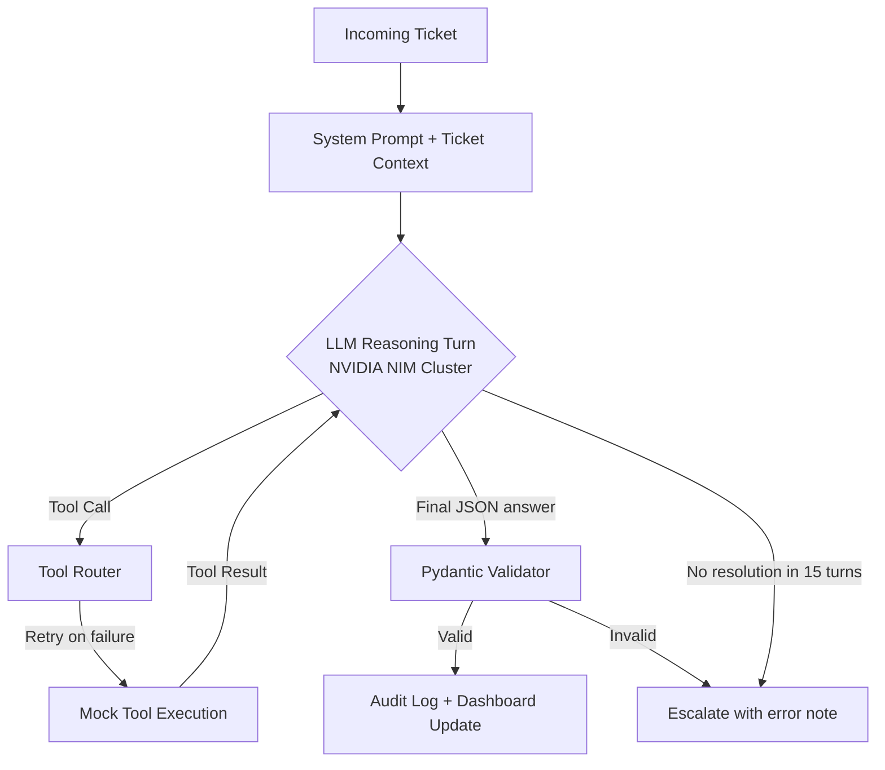

# ShopWave Agent Architecture

This document describes the high-level architecture of the ShopWave Autonomous Support Agent, as required by the Agentic AI Hackathon 2026.

## 1. High-Level Flow (ReAct Loop)

The agent follows a **Reasoning + Action** loop. For each ticket, it performs multiple turns of information gathering before reaching a final structured decision.



## 2. Hackathon Rule Compliance

| Rule | Implementation |
|------|---------------|
| **Chain** (≥3 tool calls) | **Hallucination Shield**: `tool_choice="required"` forces at least one call on Turn 0. Logic prevents final resolution until data is fetched. |
| **Recover** | `_execute_tool` retries once with exponential backoff. ToolError, TimeoutError, and general exceptions are all caught and returned as structured error payloads. |
| **Concurrency** | `asyncio.Semaphore(concurrency_limit)` in `process_all_tickets` processes tickets in parallel (default: 5 concurrent). |
| **Explain** | Every tool call, its inputs, outputs, and timestamp are logged in `audit["steps"]`. Final JSON includes `reasoning` and `confidence`. |

## 3. Key Components

### A. Core Processor (`agent/processor.py`)
The "Brain" of the system.
- **LLM**: `llama-3.3-70b-instruct` via the **NVIDIA NIM** cluster
- **Hallucination Shield**: On the very first turn (`turn 0`), the processor sets `tool_choice="required"`, making it mathematically impossible for the LLM to give an answer without selecting a tool first.
- The system prompt explicitly mandates the minimum chain: `get_customer → get_order → get_product`.
- After the ReAct loop completes, `process_ticket()` checks `tool_call_count < 3`.
- If violated, a warning flag is appended: `"WARNING: only N tool calls made (minimum 3 required)"`.
- This flag is stored in the audit log's `"flags"` array and returned in every API response for full transparency.
- **ReAct Loop**: Multi-turn conversation with the model, alternating tool calls and text responses, up to 15 turns
- **Tool Retry**: Failed tools are retried once with a 0.5s backoff before returning a structured error payload
- **State Management**: Per-ticket message history appended each turn; `asyncio.Lock` protects the shared audit log during concurrent writes

### B. Mock Tool Layer (`tools/mock_tools.py`)
A realistic simulation of a production e-commerce backend with 9 tools:

**Read/Lookup:**
- `get_order(order_id)` — Order details, status, timestamps
- `get_customer(email)` — Customer profile, tier, history
- `get_product(product_id)` — Product metadata, warranty, return policy
- `search_knowledge_base(query)` — Policy & FAQ keyword search
- `get_orders_by_email(email)` — All orders for a customer

**Write/Act:**
- `check_refund_eligibility(order_id)` — Returns eligibility + reason (may fail)
- `issue_refund(order_id, amount)` — IRREVERSIBLE; must check eligibility first
- `send_reply(ticket_id, message)` — Sends customer reply
- `escalate(ticket_id, summary, priority)` — Routes to human agent queue

**Chaos Injection:** 5% timeout rate, 8% service-error rate per tool call.

### C. Dashboard API (`main.py`)
The bridge between the AI processor and the React frontend.
- **FastAPI** with async endpoints
- **SSE** (`/run/stream`) for real-time progress events
- **Filterable audit log** (`/audit?status=&resolution=&min_confidence=`)
- **Stats aggregation** (`/stats`) — avg confidence, resolution breakdown, chain violations

## 4. Data Integrity & Schema

All final LLM outputs are validated against a **Pydantic** model before being stored:
```python
class TicketResolution(BaseModel):
    resolution: str      # resolved | refunded | escalated | policy_explained | no_action
    confidence: float    # 0.0 – 1.0
    reasoning: str       # Step-by-step explanation
    customer_message: str  # Message sent to customer
```
Inputs are sanitized by inspecting tool function signatures — hallucinated arguments are silently dropped.
